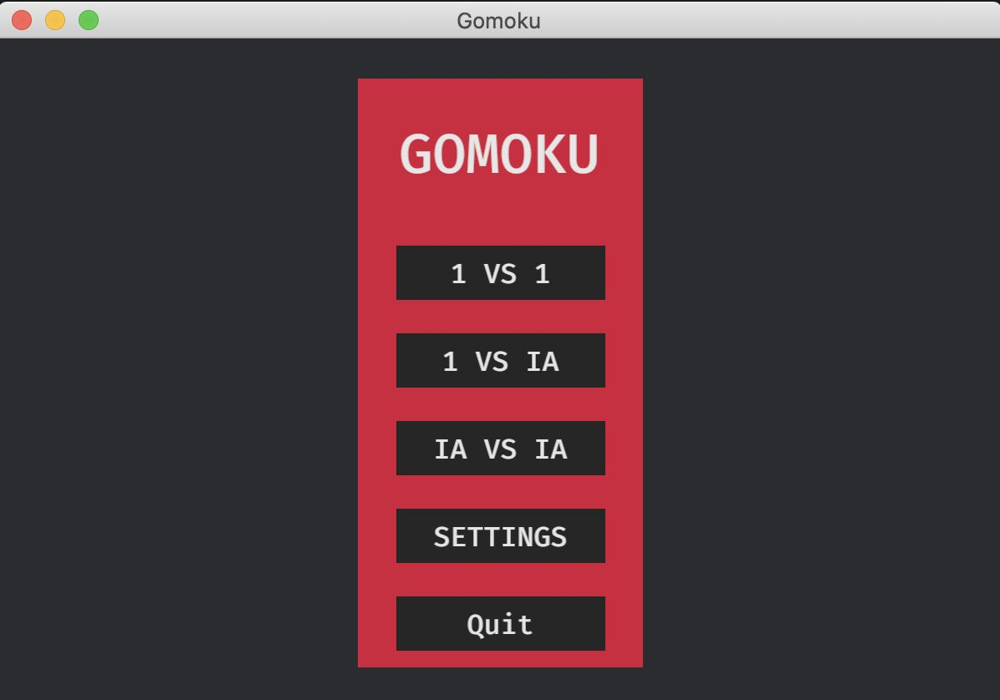
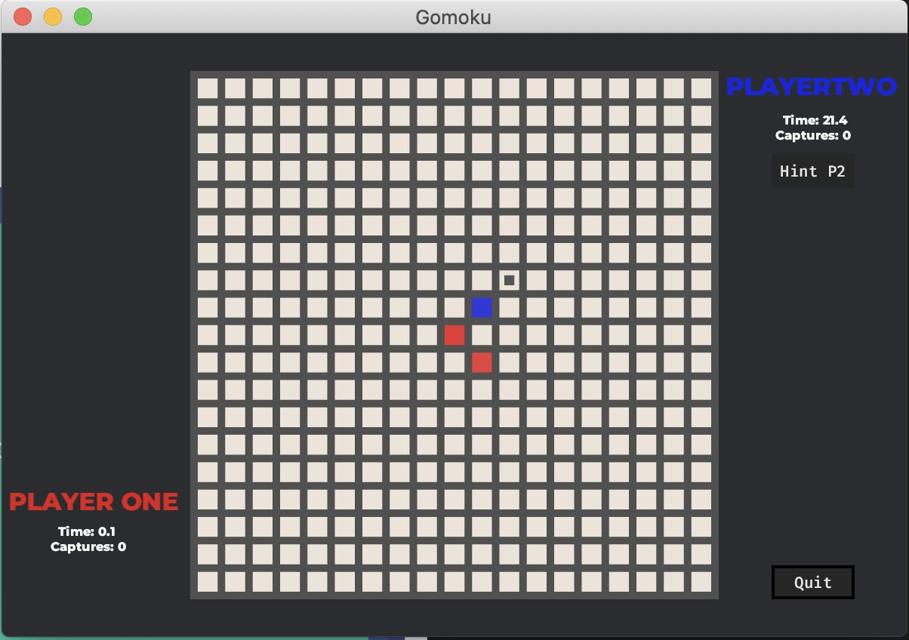
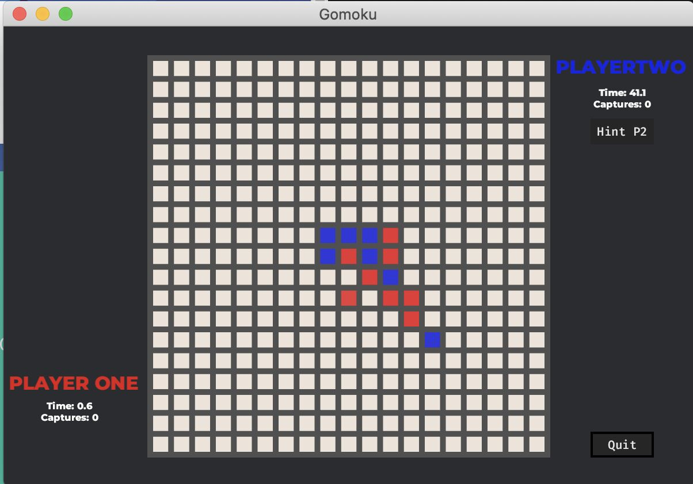

# Gomoku

[](https://www.rust-lang.org/)

A Rust-based implementation of **Gomoku** using the **Bevy** game engine and the **Minimax algorithm** with Alpha-Beta pruning for AI.

---

## 🚀 Features

- **Single-player mode:** Play against an AI with Minimax.
- **Graphical UI:** Built with Bevy for a smooth experience.
- **AI Optimization:** Efficient decision-making using Alpha-Beta pruning.

---

## 🛠 Installation

1. Ensure Rust is installed:
   ```bash
   curl --proto '=https' --tlsv1.2 -sSf https://sh.rustup.rs | sh
   ```
2. Clone and build the project:
   ```bash
   git clone https://github.com/jareste/gomoku.git
   cd gomoku
   cargo run
   ```
   **Note:** the build is heavy, so we would recommend doing:
   ```bash
   CARGO_TARGET_DIR=/tmp/gomoku/ cargo run

---

### Rules
- **Captures:** you will be able to capture any pair of stones by closing them with yours in
  any direction. This will cause on a removal of the stones. Example: XOOX (capture) XOOOX (no capture).

- **Double Free-three:** You are not allowed to do a movement that could potentially generate
  two free-threes. A free-three is a group of three stones that are alone. Example: -XXX- or -X-XX-.

- **Winning:** You may achieve five in a row stones or capture 10 stones from your opponent.


---

## 📸 Screenshots





---

## ⭐ Acknowledgements

- Built with [Bevy](https://bevyengine.org/)
- AI powered by Minimax with Alpha-Beta pruning.

---
